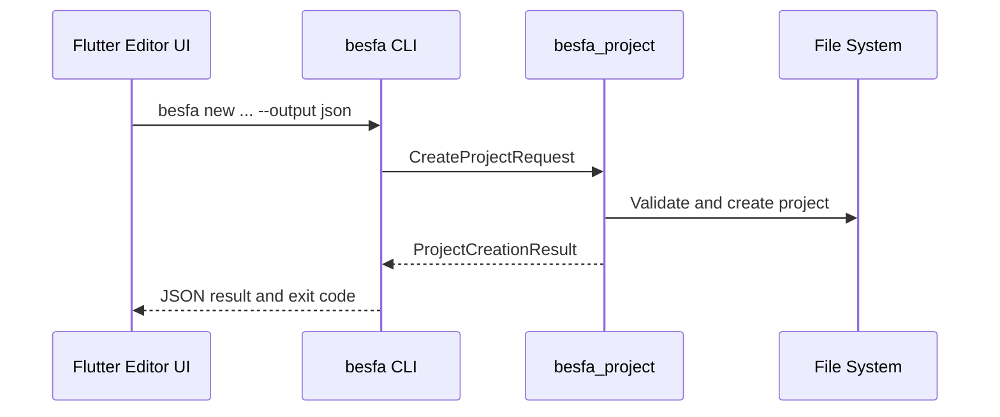
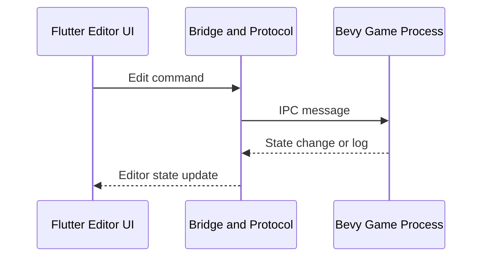
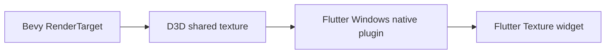

# 아키텍처

Besfa에는 수명과 책임이 다른 두 연결 경로가 있다. 프로젝트 생성 경로와 실행 중 게임 편집 경로를 같은 통신 방식으로 취급하지 않는다.

## 프로젝트 생성

`besfa_cli`는 짧게 실행되고 종료되는 자동화 도구다. Flutter UI는 CLI를 자식 프로세스로 실행하며, 실제 파일 생성 규칙은 향후 `besfa_project` crate가 담당한다.

CLI는 프로젝트 생성, 검증, 마이그레이션, 빌드 자동화와 CI 용도를 담당한다. 실행 중인 게임 세션이나 뷰포트 렌더링은 담당하지 않는다.

## 실행 중 게임 편집

에디터와 Bevy 게임은 별도 프로세스다. 게임 프로젝트에는 `besfa_editor_plugin`이 포함되고, 에디터는 장기 IPC를 통해 명령을 보내고 상태를 받는다.

## 뷰포트 표시

Windows에서는 `besfa_viewport_windows`가 Bevy의 렌더 타깃을 공유 가능한 D3D 텍스처로 노출한다. Flutter Windows 네이티브 플러그인은 이를 외부 텍스처로 등록하고, Dart는 텍스처 ID를 통해 표시한다.

이 경로는 게임 IPC와 별도다. D3D 핸들 전달, 동기화, 리사이즈는 뷰포트 전용 계약으로 다룬다.
