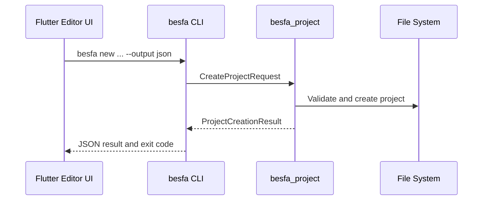
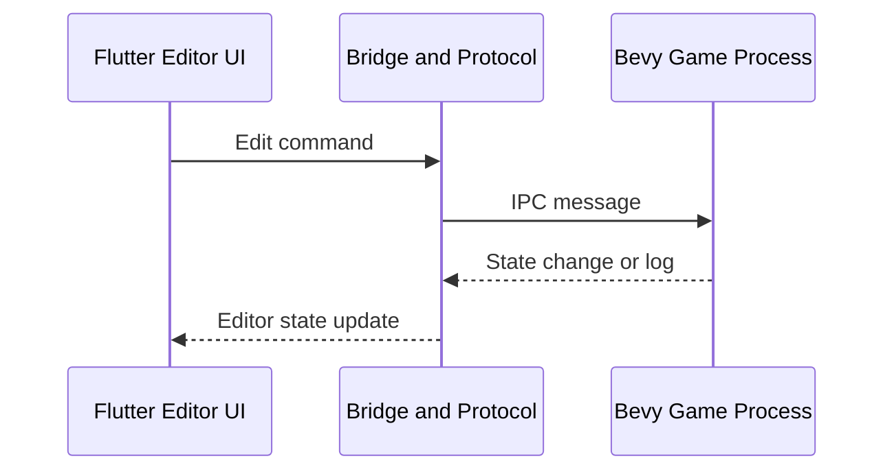
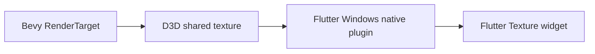

# 아키텍처

Besfa에는 수명과 책임이 다른 두 연결 경로가 있다. 프로젝트 생성 경로와 실행 중 게임 편집 경로를 같은 통신 방식으로 취급하지 않는다.

## 프로젝트 생성

`besfa_cli`는 짧게 실행되고 종료되는 자동화 도구다. Flutter UI는 CLI를 자식 프로세스로 실행하며, 실제 파일 생성 규칙은 향후 `besfa_project` crate가 담당한다.

```mermaid
sequenceDiagram
    participant UI as Flutter Editor UI
    participant CLI as besfa CLI
    participant Project as besfa_project
    participant FS as File System

    UI->>CLI: besfa new ... --output json
    CLI->>Project: CreateProjectRequest
    Project->>FS: Validate and create project
    Project-->>CLI: ProjectCreationResult
    CLI-->>UI: JSON result and exit code
```

CLI는 프로젝트 생성, 검증, 마이그레이션, 빌드 자동화와 CI 용도를 담당한다. 실행 중인 게임 세션이나 뷰포트 렌더링은 담당하지 않는다.

## 실행 중 게임 편집

에디터와 Bevy 게임은 별도 프로세스다. 게임 프로젝트에는 `besfa_editor_plugin`이 포함되고, 에디터는 장기 IPC를 통해 명령을 보내고 상태를 받는다.

```mermaid
sequenceDiagram
    participant UI as Flutter Editor UI
    participant Bridge as Bridge and Protocol
    participant Game as Bevy Game Process

    UI->>Bridge: Edit command
    Bridge->>Game: IPC message
    Game-->>Bridge: State change or log
    Bridge-->>UI: Editor state update
```

아직 `besfa_protocol`은 없다. 지금은 게임의 표준 입출력이 유일한 채널이고, 양쪽 모두 한 줄에 JSON 객체 하나를 쓴다. 에디터는 게임의 stdin에 `command`로 이름 붙인 명령을 쓴다: 편집 상태에서 실행 상태로 넘기는 `play`, 엔티티를 고르거나(`id`) 선택을 지우는 `select`, 씬 파일을 쓰는 `save`, 컴포넌트 값을 통째로 바꾸는 `set`(`id`, `component`, `value`), 기본값으로 붙이는 `insert`와 떼는 `remove`(`id`, `component`), 씬 엔티티를 만드는 `spawn`(`kind`: `empty`, `cube`, `sphere`, `plane`, `light`, `camera`), `duplicate`와 `despawn`(`id`). 엔티티 `id`는 게임이 보고한 Bevy 엔티티 비트이고, `component`는 Reflect 타입 경로(씬 파일과 같은 이름)다. 값은 게임이 보고한 JSON 모양 그대로이며, 빠진 필드는 그 타입의 기본값이 된다. 게임은 stdout에 `@besfa ` 접두어와 JSON 객체 한 줄로 보고하고, 에디터는 이 접두어로 보고와 로그를 구분한다. `type`이 `entities`인 씬 엔티티 목록(id, 이름, 부모, 씬 파일에 저장되는지; `Name`이나 `Transform`이 있는 엔티티와 그 자식)과 `entity`인 선택한 엔티티의 컴포넌트(계산되는 것인지 포함)는 바뀔 때마다, `systems`인 스케줄별 시스템 목록과 `components`인 추가할 수 있는 컴포넌트 목록은 게임이 시작하기 전에 한 번 보낸다. 게임이 스스로 선택을 바꾸면(`spawn`, `duplicate`, 선택한 엔티티가 사라질 때) `selected`를, `save`의 결과는 `saved`(실패하면 `error`)를 보낸다. 받아들이지 못한 명령은 게임 로그에 오류로 남는다. 실행 상태를 끝낼 때는 프로세스를 종료하고 편집 상태로 다시 실행한다. Bevy Remote Protocol로 옮기는 것은 Bevy를 다시 빌드해야 하고 HTTP 포트를 관리해야 해서 미룬다.

## 뷰포트 표시

Windows에서는 `besfa_viewport_windows`가 Bevy의 렌더 타깃을 공유 가능한 D3D 텍스처로 노출한다. Flutter Windows 네이티브 플러그인은 이를 외부 텍스처로 등록하고, Dart는 텍스처 ID를 통해 표시한다.

```mermaid
flowchart LR
    Bevy[Bevy RenderTarget] --> Shared[D3D shared texture]
    Shared --> Plugin[Flutter Windows native plugin]
    Plugin --> Texture[Flutter Texture widget]
```

이 경로는 게임 IPC와 별도다. D3D 핸들 전달, 동기화, 리사이즈는 뷰포트 전용 계약으로 다룬다.
